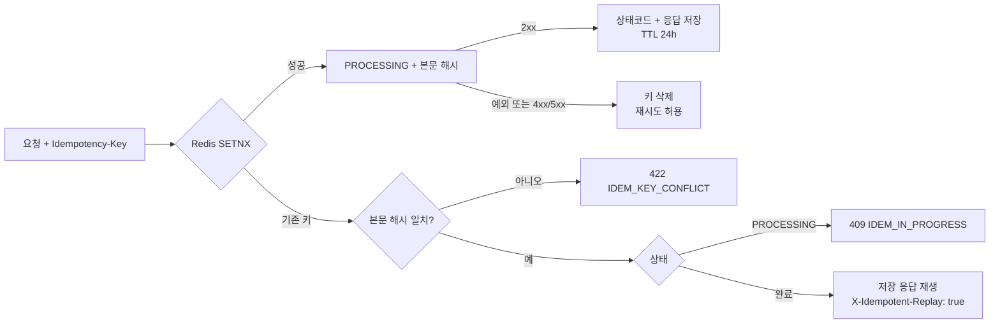

# FRACTA

> 토큰증권 기반 조각투자 발행·유통 플랫폼 + 오픈 API

부동산·리츠 등 실물 기반 자산을 조각 단위 **토큰증권**으로 발행하고, 투자자가 청약·매매하며, 그 전 기능을 외부 개발자에게 **Open API**로 개방하는 플랫폼.

> **현재 상태: Phase 1~7 완료** (기반 · 원장 · 계좌/발행 · 청약 · 증권사 연동 · 유통/결제 · 오픈 API)
> 테스트 235건 전부 통과. 실측 자료는 아래 [실측 기록](#실측-기록) 참조.
> FSD §16이 요구하는 나머지 항목(데모 영상 등)은 이후 Phase에서 채웁니다.

---

## 문서

| 문서 | 내용 |
|---|---|
| [`docs/FSD.md`](docs/FSD.md) | 기능 사양서 (v1.1) — **단일 진실 공급원(SSOT)** |
| [`docs/phases/README.md`](docs/phases/README.md) | Phase 11개 인덱스 및 의존 관계 |
| [`CLAUDE.md`](CLAUDE.md) | AI 개발 에이전트용 프로젝트 규칙 |
| [`docs/reference/plug-error-codes.md`](docs/reference/plug-error-codes.md) | namuh PLUG 게이트웨이 오류코드와 처리 정책 |
| [`docs/appendix/risk-profile-questions.md`](docs/appendix/risk-profile-questions.md) | 투자성향 진단 8문항·배점표 |

### 실측 기록

추정치가 아니라 **실제로 측정한 값**만 기록합니다.

| 문서 | 핵심 수치 |
|---|---|
| [청약 동시성 비교](docs/benchmarks/subscription-concurrency.md) | 500 VU에서 3방식 모두 배정 정합성 100%. 원자적 감소 153.9 TPS / p95 1,767ms로 최고 |
| [증권사 호출 유량](docs/benchmarks/broker-quota.md) | 문서값 4~5건/초와 달리 **실효 한도 약 1건/초**. 지속 폴링 902회 전부 성공, 쿼터 초과 0건 |
| [매칭·결제 처리량](docs/benchmarks/trading-matching.md) | 매칭 엔진 640,902건/초, 주문 API p95 32.7ms. 결제 포함 주문 경로는 39.8건/초 |
| [원장 설계 노트](docs/notes/phase-02-ledger-notes.md) | 해시체인 append 약 225 tps, 1만 건 검증 87ms |

### Open API 사용 규격

LIVE는 `/open/v1`, 샌드박스는 `/open/sandbox/v1`을 사용합니다. OAuth2 Client Credentials로
발급받은 토큰에는 `market:read`, `account:read`, `order:write`, `subscription:write` 중 등록된
scope만 들어갑니다. Swagger UI는 `/swagger-ui.html`, OpenAPI JSON은 `/v3/api-docs`에서 확인합니다.

#### 멱등성 상태 전이

주문·주문 취소·청약은 `Idempotency-Key`가 필수이며 완료 응답은 24시간 보관합니다.



#### Rate Limit

기본 한도는 클라이언트별 초당 10건·일 10,000건이며 Redis 슬라이딩 윈도우로 창 경계
버스트도 차단합니다. 성공과 실패 응답 모두 아래 헤더를 제공합니다.

| 헤더 | 의미 |
|---|---|
| `X-RateLimit-Limit` | 초당 허용량 |
| `X-RateLimit-Remaining` | 현재 슬라이딩 창의 잔여량 |
| `X-RateLimit-Reset` | 가장 이른 요청이 창에서 빠지는 Unix 시각(초) |
| `Retry-After` | 429 응답에서 재시도까지 기다릴 초 |

#### 웹훅 서명 검증

서명 대상은 수신한 **raw body 그대로**인 `"{timestamp}.{raw_body}"`입니다. 타임스탬프가 현재
시각 ±5분인지 먼저 확인한 뒤 타이밍 세이프 비교를 사용합니다.

```javascript
import crypto from "node:crypto";

export function verifyWebhook(secret, rawBody, signature) {
  const match = /^t=(\d+),v1=([0-9a-f]{64})$/.exec(signature ?? "");
  if (!match || Math.abs(Date.now() / 1000 - Number(match[1])) > 300) return false;
  const expected = crypto.createHmac("sha256", secret)
    .update(`${match[1]}.${rawBody}`, "utf8").digest("hex");
  return crypto.timingSafeEqual(Buffer.from(expected, "hex"), Buffer.from(match[2], "hex"));
}
```

```python
import hashlib, hmac, time

def verify_webhook(secret: str, raw_body: bytes, signature: str) -> bool:
    try:
        timestamp, supplied = signature.removeprefix("t=").split(",v1=", 1)
        if abs(int(time.time()) - int(timestamp)) > 300:
            return False
        signed = timestamp.encode() + b"." + raw_body
        expected = hmac.new(secret.encode(), signed, hashlib.sha256).hexdigest()
        return hmac.compare_digest(expected, supplied)
    except (AttributeError, ValueError):
        return False
```

#### LIVE와 샌드박스

| 항목 | LIVE | SANDBOX |
|---|---|---|
| 기본 경로 | `/open/v1` | `/open/sandbox/v1` |
| 데이터 | `public` 스키마의 서비스 데이터 | `sandbox` 스키마의 가상 데이터 |
| 초기 예치금 | 실제 모의 예치금 | 클라이언트별 가상 1억원 |
| 원자산 시세 | 활성 시세 어댑터 | 항상 `MockMarketDataAdapter` |
| 토큰 호환 | LIVE 토큰만 | SANDBOX 토큰만 |

두 환경의 경로와 토큰이 어긋나면 `403 AUTH_ENV_MISMATCH`로 거부되며, 테이블·잔고·주문·청약은
스키마 수준에서 완전히 분리됩니다.

---

## 기술 스택

**Backend** Java 21 · Spring Boot 3.3 · JPA + QueryDSL · Spring Batch 5
**Infra** PostgreSQL 16 (pgvector) · Redis 7 · MinIO · Docker Compose
**Frontend** Next.js 14 (App Router) · TypeScript · Tailwind + shadcn/ui
**AI** Python FastAPI · bge-m3 임베딩 · Claude API ↔ Ollama 어댑터 스위치
**외부 연동** NH투자증권 namuh PLUG Open API (모의 도메인, 시세 조회 전용)
**테스트** JUnit5 · Testcontainers · WireMock · k6

---

## 설계 원칙

1. **정합성 > 성능 > 기능 수.** 불변식을 깨는 최적화는 금지
2. **부동소수점 금지.** 금액·수량은 내부 `long`, 표현은 `BigDecimal`. `Money`/`Units` 값 객체 경유
3. **포트-어댑터.** 원장·LLM·증권사 API는 인터페이스 + 구현체 분리
4. **모듈러 모놀리스.** MSA로 쪼개지 않음. 모듈 간 호출은 `api` 패키지 공개 인터페이스로만
5. **모든 상태 변경은 감사 로그를 남긴다**

---

## 차별 포인트

| # | 항목 | Phase |
|---|---|---|
| 1 | **해시체인 원장 + 불변식 6종 자동 검증** — 블록체인 없이 위변조 검출 | [2](docs/phases/phase-02-ledger.md), [9](docs/phases/phase-09-batch.md) |
| 2 | **청약 동시성 3방식 구현·실측 비교** — 비관적 락 / Redis 분산락 / DB 원자적 감소 | [4](docs/phases/phase-04-subscription.md) |
| 3 | **괴리율 기반 자동 거래 중단** — 원자산 시세 대비 ±20% 초과 시 자동 `SUSPENDED` | [6](docs/phases/phase-06-trading-settlement.md) |
| 4 | **오픈 API 게이트웨이** — OAuth2 · Scope · Rate Limit · 멱등성 · 웹훅 서명 · 샌드박스 | [7](docs/phases/phase-07-openapi.md) |
| 5 | **금소법 대응 AI 가드레일** — 프롬프트가 아닌 **코드로** 투자권유·환각 인용 차단 | [8](docs/phases/phase-08-ai.md) |

---

## 로컬 실행 (Phase 1 완료 후)

```bash
docker compose up -d          # PostgreSQL / Redis / MinIO
./gradlew build
./gradlew test
```

**사전 요구사항**: JDK 21 · Docker Desktop · Node.js 20+ · Python 3.11

---

## 진행 현황

| Phase | 내용 | 상태 |
|---|---|---|
| 1 | [기반](docs/phases/phase-01-foundation.md) | ✅ |
| 2 | [원장](docs/phases/phase-02-ledger.md) | ✅ |
| 3 | [계좌·발행](docs/phases/phase-03-account-issuance.md) | ✅ |
| 4 | [청약](docs/phases/phase-04-subscription.md) | ✅ |
| 5 | [증권사 연동](docs/phases/phase-05-broker-integration.md) | ✅ |
| 6 | [유통·결제](docs/phases/phase-06-trading-settlement.md) | ✅ |
| 7 | [오픈 API](docs/phases/phase-07-openapi.md) | ⬜ |
| 8 | [AI](docs/phases/phase-08-ai.md) | ⬜ |
| 9 | [배치](docs/phases/phase-09-batch.md) | ⬜ |
| 10 | [프론트](docs/phases/phase-10-frontend.md) | ⬜ |
| 11 | [마감](docs/phases/phase-11-release.md) | ⬜ |

---

## 범위 밖 (명시적 비목표)

- 실제 블록체인 노드 운영 → 해시체인 원장으로 대체
- 실제 자금 이체 → 예치금은 시뮬레이션 원장
- 실제 KYC 심사 → Mock 처리
- **증권사 실전 계좌 연동 및 주문 전송** → 모의 도메인 시세 조회 전용
- 다국어, 모바일 네이티브 앱

---

## 라이선스

포트폴리오 목적의 개인 프로젝트입니다.
