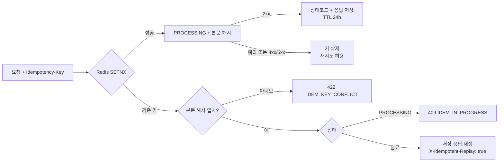
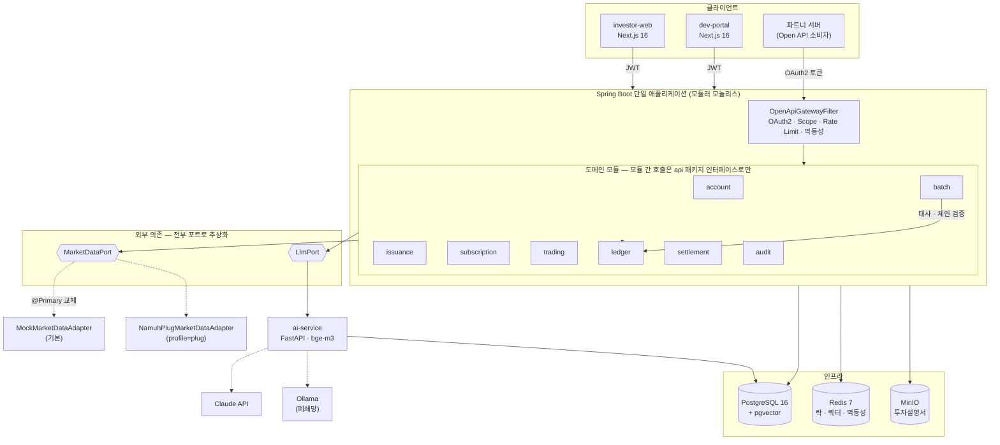
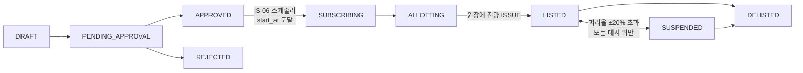
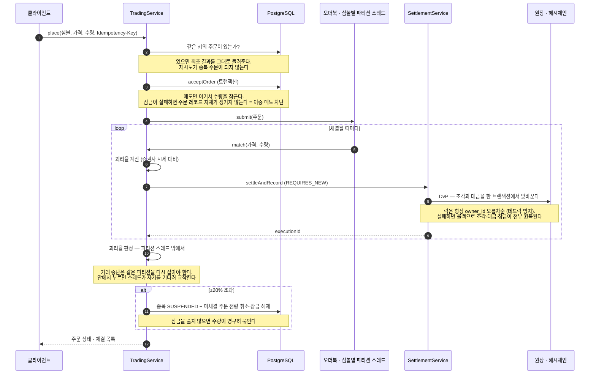

# FRACTA

> 토큰증권 기반 조각투자 발행·유통 플랫폼 + 오픈 API

부동산·리츠 등 실물 기반 자산을 조각 단위 **토큰증권**으로 발행하고, 투자자가 청약·매매하며, 그 전 기능을 외부 개발자에게 **Open API**로 개방하는 플랫폼.

> **현재 상태: Phase 1~7·9·10 완료 + Phase 8 AI 코드 완료(폐쇄망 실측 대기)**
> (기반 · 원장 · 계좌/발행 · 청약 · 증권사 연동 · 유통/결제 · 오픈 API · AI 가드레일 · 배치 · 프론트엔드)
> 테스트 **421건** 전부 통과 — Java 281건(Testcontainers) + Python 140건(pytest).
> 실측 자료는 아래 [실측 기록](#실측-기록) 참조.
> Phase 8은 폐쇄망(Ollama) 품질·지연 비교와 캡처만 남았습니다 — RTX 4080 데스크탑에서
> 측정합니다. 추정치로 표를 채우지 않습니다.
> FSD §16이 요구하는 나머지 항목(데모 영상 등)은 이후 Phase에서 채웁니다.

---

## 문서

| 문서 | 내용 |
|---|---|
| [`docs/FSD.md`](docs/FSD.md) | 기능 사양서 (v1.1.3) — **단일 진실 공급원(SSOT)** |
| [`docs/phases/README.md`](docs/phases/README.md) | Phase 11개 인덱스 및 의존 관계 |
| [`CLAUDE.md`](CLAUDE.md) | AI 개발 에이전트용 프로젝트 규칙 |
| [`docs/reference/plug-error-codes.md`](docs/reference/plug-error-codes.md) | namuh PLUG 게이트웨이 오류코드와 처리 정책 |
| [`docs/appendix/risk-profile-questions.md`](docs/appendix/risk-profile-questions.md) | 투자성향 진단 8문항·배점표 |
| [`docs/ai/guardrail-design.md`](docs/ai/guardrail-design.md) | 금소법 대응 매핑, 3단계 가드레일, **실제 우회 사례** |
| [`docs/ai/provider-comparison.md`](docs/ai/provider-comparison.md) | Claude ↔ 폐쇄망 비교 — 측정 방법과 현재 상태 |
| [`docs/ai/similarity-threshold.md`](docs/ai/similarity-threshold.md) | RAG 유사도 임계값 실측 — **0.6 → 0.48** 조정 근거 |
| [`docs/demo-script.md`](docs/demo-script.md) | 데모 영상 촬영 대본 — 컷별 화면·대사·검증된 명령 |
| [`docs/invariants.md`](docs/invariants.md) | INV-1~6 정의·자동 검증·위반 대응·의도적 훼손 시연 |
| [`docs/appendix/guardrail-attack-prompts.md`](docs/appendix/guardrail-attack-prompts.md) | 공격 프롬프트 20종과 차단 결과표 (자동 생성) |
| [`ai-service/README.md`](ai-service/README.md) | AI 서비스 구조와 실행 |

### 실측 기록

추정치가 아니라 **실제로 측정한 값**만 기록합니다.

| 문서 | 핵심 수치 |
|---|---|
| [청약 동시성 비교](docs/benchmarks/subscription-concurrency.md) | 500 VU에서 3방식 모두 배정 정합성 100%. 원자적 감소 153.9 TPS / p95 1,767ms로 최고 |
| [증권사 호출 유량](docs/benchmarks/broker-quota.md) | 문서값 4~5건/초와 달리 **실효 한도 약 1건/초**. 지속 폴링 902회 전부 성공, 쿼터 초과 0건 |
| [매칭·결제 처리량](docs/benchmarks/trading-matching.md) | 매칭 엔진 640,902건/초, 주문 API p95 32.7ms. 결제 포함 주문 경로는 39.8건/초 |
| [원장 설계 노트](docs/notes/phase-02-ledger-notes.md) | 해시체인 append 약 225 tps, 1만 건 검증 87ms |
| [RAG 유사도 임계값](docs/ai/similarity-threshold.md) | bge-m3 실측 — 관련 질문 0.527~0.654 / 무관 0.350~0.429. FSD 기본값 0.6은 정상 질문 4/10을 차단해 **0.48로 조정** |
| [AI 프로바이더 비교](docs/ai/provider-comparison.md) | Claude Opus 5 30건 — p50 4.429초, p95 6.031초, $0.3045, 가드레일 100%, 정확 인용 50% |
| [불변식 배치 검증](docs/invariants.md#10만-건-실측) | 원장 체인 10만 건 598ms, 잔고 10만 건 대사 880ms (체인 단계 포함) |

### Open API 사용 규격

LIVE는 `/open/v1`, 샌드박스는 `/open/sandbox/v1`을 사용합니다. OAuth2 Client Credentials로
발급받은 토큰에는 `market:read`, `account:read`, `order:write`, `subscription:write` 중 등록된
scope만 들어갑니다. Swagger UI는 `/swagger-ui.html`, OpenAPI JSON은 `/v3/api-docs`에서 확인합니다.

#### 멱등성 상태 전이

주문·주문 취소·청약은 `Idempotency-Key`가 필수이며 완료 응답은 24시간 보관합니다.



#### Rate Limit

기본 한도는 클라이언트별 초당 10건·일 10,000건이며 Redis 슬라이딩 윈도우로 창 경계
버스트도 차단합니다. 성공과 실패 응답 모두 아래 헤더를 제공합니다.

| 헤더 | 의미 |
|---|---|
| `X-RateLimit-Limit` | 초당 허용량 |
| `X-RateLimit-Remaining` | 현재 슬라이딩 창의 잔여량 |
| `X-RateLimit-Reset` | 가장 이른 요청이 창에서 빠지는 Unix 시각(초) |
| `Retry-After` | 429 응답에서 재시도까지 기다릴 초 |

#### 웹훅 서명 검증

서명 대상은 수신한 **raw body 그대로**인 `"{timestamp}.{raw_body}"`입니다. 타임스탬프가 현재
시각 ±5분인지 먼저 확인한 뒤 타이밍 세이프 비교를 사용합니다.

```javascript
import crypto from "node:crypto";

export function verifyWebhook(secret, rawBody, signature) {
  const match = /^t=(\d+),v1=([0-9a-f]{64})$/.exec(signature ?? "");
  if (!match || Math.abs(Date.now() / 1000 - Number(match[1])) > 300) return false;
  const expected = crypto.createHmac("sha256", secret)
    .update(`${match[1]}.${rawBody}`, "utf8").digest("hex");
  return crypto.timingSafeEqual(Buffer.from(expected, "hex"), Buffer.from(match[2], "hex"));
}
```

```python
import hashlib, hmac, time

def verify_webhook(secret: str, raw_body: bytes, signature: str) -> bool:
    try:
        timestamp, supplied = signature.removeprefix("t=").split(",v1=", 1)
        if abs(int(time.time()) - int(timestamp)) > 300:
            return False
        signed = timestamp.encode() + b"." + raw_body
        expected = hmac.new(secret.encode(), signed, hashlib.sha256).hexdigest()
        return hmac.compare_digest(expected, supplied)
    except (AttributeError, ValueError):
        return False
```

#### LIVE와 샌드박스

| 항목 | LIVE | SANDBOX |
|---|---|---|
| 기본 경로 | `/open/v1` | `/open/sandbox/v1` |
| 데이터 | `public` 스키마의 서비스 데이터 | `sandbox` 스키마의 가상 데이터 |
| 초기 예치금 | 실제 모의 예치금 | 클라이언트별 가상 1억원 |
| 원자산 시세 | 활성 시세 어댑터 | 항상 `MockMarketDataAdapter` |
| 토큰 호환 | LIVE 토큰만 | SANDBOX 토큰만 |

두 환경의 경로와 토큰이 어긋나면 `403 AUTH_ENV_MISMATCH`로 거부되며, 테이블·잔고·주문·청약은
스키마 수준에서 완전히 분리됩니다.

### AI 가드레일

투자설명서 질의응답에 LLM을 붙일 때의 문제는 성능이 아니라 **책임**입니다. 챗봇이
"이거 유망합니다"라고 한 줄 답하는 순간 금소법상 투자권유 절차를 우회한 권유가 됩니다.
그래서 프롬프트가 아니라 **코드로** 막습니다.

```
질문 ─① 입력 가드레일 ── 차단 ─▶ 고정 문구 (LLM 호출 0건)
     │   인젝션 / 개인정보
     ├─  임베딩 → 코사인 top-5, 유사도 < 0.48 ▶ 고정 문구 (LLM 호출 0건)
     ├─② 시스템 프롬프트 + 구조화 출력(output_config.format)
     └─③ 출력 가드레일 (코드 검증)
         refusal · JSON 파싱 실패 · 금지 표현 · 인용 없음 · 검색결과 밖 인용 → 차단
         재시도는 1회만
```

**핵심은 ③입니다.** ①은 뚫려도 ③이 받고, ②는 모델의 협조를 구할 뿐 강제가 아닙니다.
개발 중 FSD가 정한 정규식이 **띄어쓰기 하나로** 빠져나가는 사례를 확인했습니다 —
`매수추천`은 잡히지만 `매수 추천`은 통과합니다. 그래서 문자열 매칭에만 기대지 않고
"인용 페이지가 이번 검색 결과 안에 있는가"라는 **구조적** 판정을 함께 둡니다.
표현은 무한히 변형되지만 이건 변형할 수 없는 사실 판정입니다.
상세와 우회 사례 전체는 [`docs/ai/guardrail-design.md`](docs/ai/guardrail-design.md).

| 검증 | 결과 |
|---|---|
| 권유 유도 프롬프트 20종 | 실제 Claude 응답 기준 권유 표현 사용자 도달 0/20 |
| 프롬프트 인젝션 20종 (입력 단계) | 20/20 차단 — 단, 알려진 표현만 잡는다는 한계를 문서에 명시 |
| 개인정보 포함 질문 | 차단 (LLM 호출 없음 → 외부로 나가지 않음) |
| 환각 인용 | 차단 (`cited_pages` + 본문 `[p.N]` 2중 검사) |
| 검색 정확도 (bge-m3 실측) | 관련 질문 10/10 올바른 페이지 1위 |

**두 개의 모델이 다른 자리에 있습니다.** `bge-m3`(임베딩)는 텍스트를 벡터로 바꿔
검색만 하고, Claude/Ollama(LLM)가 검색된 발췌문으로 답을 씁니다. `AI_PROVIDER`
스위치는 **LLM에만** 걸립니다 — LLM만 로컬로 바꾸고 임베딩을 외부 API로 보내면
질문 텍스트가 밖으로 나가므로 폐쇄망이 성립하지 않기 때문입니다.

---

## 아키텍처

실제 구현된 것만 그립니다 — 계획했다가 안 만든 컴포넌트는 넣지 않습니다.



**읽는 법**

- **점선은 교체 가능한 지점**입니다. `MarketDataPort`는 프로파일로 Mock ↔ namuh PLUG가
  바뀌고([교체 테스트](src/test/java/com/fracta/external/broker/MarketDataPortSwapTest.java)),
  `LlmPort` 뒤의 ai-service는 `AI_PROVIDER`로 Claude ↔ Ollama가 바뀝니다.
- **MSA가 아닙니다.** 하나의 Spring Boot 프로세스이고, 모듈 경계는 패키지와
  `api` 공개 인터페이스로만 지켜집니다. 엔티티 직접 참조를 금지합니다.
- **블록체인 노드가 없습니다.** 원장은 PostgreSQL 안의 append-only 해시체인입니다.
- **메시지 브로커가 없습니다.** 이벤트는 Spring `ApplicationEventPublisher` +
  `@TransactionalEventListener(AFTER_COMMIT)`, 비동기 웹훅만 Redis Stream을 씁니다.

---

## 동작 청사진

구조도가 *무엇이 있는가*라면, 이 절은 *실제로 어떤 순서로 도는가*입니다.

### 1. 조각 하나의 일생

발행인이 자산을 올리고 → 투자자가 청약하고 → 배정받아 상장되고 → 거래되고 → 매일 검증됩니다.
**상태 전이 규칙은 `IssuanceStatus` enum 하나가 단일 진실**입니다. 서비스 코드에 if로 흩어 두지 않습니다.



| 단계 | 담당 모듈 | 이때 지켜지는 것 |
|---|---|---|
| 청약 접수 | `subscription` | 잔여 수량 원자적 감소. 3방식(비관적 락 / Redis 분산락 / DB 원자 감소)을 구현하고 [실측 비교](docs/benchmarks/subscription-concurrency.md)했습니다 |
| 적합성 확인 | `account` | 투자성향보다 위험한 상품은 `SUIT_PROFILE_MISMATCH`로 거부. 부적합 확인이 있어야 통과합니다 |
| 배정 | `subscription` | 초과 청약이면 비례배분 후 **잔여 분배까지** 수행. `Σ배정 == min(발행량, Σ신청)` (INV-5) |
| 상장 | `issuance` + `ledger` | 발행 총량을 원장에 ISSUE. 이후 `Σledger_balance == 발행량`(INV-1)이 영구 불변식이 됩니다 |
| 거래 | `trading` + `settlement` | 아래 2번 |
| 검증 | `batch` | 매일 23:00 불변식 6종 대사. 위반 시 **자동 복구하지 않고** 거래를 중단합니다 |

### 2. 주문 한 건이 지나가는 길

가장 복잡한 경로입니다. **조각만 넘어가고 대금이 안 넘어간 순간이 단 한 번도 없어야** 합니다.



### 3. 오픈 API 요청 한 건이 지나가는 길

파트너 서버가 부르는 경로는 웹앱과 **입구가 다릅니다**. `OpenApiGatewayFilter` 하나가 앞단을 전부 처리합니다.

```
요청 → OAuth2 토큰 검증 → Scope 확인 → 환경 일치(SANDBOX/LIVE) → Rate Limit
     → 멱등성 키 처리 → 컨트롤러 → 호출 로그 기록 → 응답 (X-RateLimit-* 헤더 부착)
```

웹앱 JWT와 오픈 API JWT는 **서명 시크릿이 다릅니다**(`openapi.jwt.secret`). 같은 값이면 권한 경계가 무너집니다.

### 4. 검증은 언제 도는가

| 배치 | 주기 | 하는 일 |
|---|---|---|
| 일일 대사 | 매일 23:00 | 불변식 6종 검사. 위반 → 해당 종목(전역 위반이면 전 종목) `SUSPENDED` |
| 체인 검증 | 매일 23:30 | `prev_hash` 연결과 SHA-256 재계산 (INV-4) |
| 정산 리포트 | 매일 18:00 | 일별 체결·수수료 집계 |
| 증권사 토큰 갱신 | 30분마다 | 만료 30분 전 선제 갱신 |

불변식 정의와 훼손 시연 결과는 [`docs/invariants.md`](docs/invariants.md)에 있습니다. 여기서 반복하지 않습니다.

---

## 기술 선택 근거

"무엇을 썼는가"보다 **"무엇을 왜 안 썼는가"** 가 설명하기 어렵습니다.

| 선택 | 대안 | 왜 이렇게 했는가 |
|---|---|---|
| **해시체인 원장** (PostgreSQL) | 블록체인 노드 | 요구사항은 *위변조 검출*이지 *탈중앙 합의*가 아닙니다. 노드 운영 없이 append-only + 해시체인 + 배치 검증으로 같은 보장을 얻습니다. 10만 건 체인 검증 598ms — [실측](docs/invariants.md#10만-건-실측) |
| **Spring 이벤트** | Kafka | 1인 프로젝트 규모에서 브로커 운영 비용이 이득을 넘습니다. 트랜잭션 경계와 이벤트 발행을 `AFTER_COMMIT`으로 붙일 수 있어 정합성도 더 단순합니다 (FSD §4.2) |
| **모듈러 모놀리스** | MSA | 원장·청약·결제가 한 트랜잭션에 묶입니다. 서비스로 쪼개면 분산 트랜잭션이 필요하고, 그건 이 프로젝트가 지키려는 불변식과 정면으로 충돌합니다 |
| **NH namuh PLUG** | 한국투자증권(KIS) | KIS는 실전 계좌·실거래 승인이 전제입니다. 모의 도메인만으로 시세를 받을 수 있는 PLUG가 "실거래 없이 실제 연동"이라는 이 프로젝트 제약에 맞습니다. 근거는 [Phase 5 §0](docs/phases/phase-05-broker-integration.md) |
| **시세 조회 전용** | 증권사 주문 전송 | 체결은 자체 오더북에서 합니다. 외부에 주문을 보내면 실거래가 되어 비목표를 넘습니다. `BrokerSafetyValidator`가 실전 계좌 설정을 부팅 단계에서 막습니다 |
| **Testcontainers** | H2 | advisory lock과 pgvector가 H2에서 동작하지 않습니다. 이 둘이 정합성 설계의 핵심이라 인메모리 DB로는 검증 자체가 성립하지 않습니다 |
| **자체 호스팅 Pretendard** | 웹폰트 CDN | 폐쇄망 모드에서 외부 CDN에 접근할 수 없습니다. AI만 폐쇄망이고 폰트는 CDN이면 시연이 성립하지 않습니다 |

---

## 기술 스택

*"쓴다고 적어두고 실제로는 안 쓰는 것"이 없도록, 각 항목에 실제 사용처를 적었습니다.*

| 영역 | 기술 | 어디에 쓰이는가 |
|---|---|---|
| **언어·런타임** | Java 21 | 백엔드 단일 프로세스 전체 |
| | Spring Boot 3.3 | 모듈러 모놀리스의 뼈대. 이벤트도 `ApplicationEventPublisher`로 처리합니다 |
| **영속화** | JPA (Hibernate) | 모든 도메인 엔티티. 원장 해시체인만 JDBC로 직접 씁니다 |
| | Flyway | 스키마 마이그레이션 (`ddl-auto: none`) |
| **배치** | Spring Batch 5 | 일일 대사·체인 검증·정산 리포트·API 로그 아카이브 |
| **저장소** | PostgreSQL 16 | 원장(append-only 해시체인), 도메인 테이블, `pg_advisory_xact_lock` |
| | pgvector | 투자설명서 청크 임베딩 검색 (ai-service) |
| | Redis 7 | 청약 분산락 · 오픈 API 쿼터/멱등성 · 증권사 토큰 캐시 · 웹훅 Stream · 배치 잡 락 |
| | MinIO | 투자설명서 PDF 원본 |
| **프론트** | Next.js 16 (App Router) | investor-web 7개 화면 · dev-portal 6개 화면 |
| | Tailwind v4 + Base UI | `packages/ui` 디자인 시스템 (OKLCH 토큰) |
| | TanStack Query | 서버 상태 전체. 401 처리도 `QueryCache.onError` 한 곳에서 합니다 |
| | lightweight-charts | 종목 상세의 기초자산 시세 캔들 차트 |
| | Recharts | 개발자 포털 대시보드의 호출량 추이 |
| | cmdk | Ctrl+K 커맨드 팔레트 |
| | Pretendard (자체 호스팅) | 전 화면 본문. 폐쇄망에서도 떠야 해서 CDN을 쓰지 않습니다 |
| **AI** | Python FastAPI | ai-service — 인덱싱·검색·질의 |
| | bge-m3 | 임베딩. `AI_PROVIDER`와 무관하게 항상 로컬에서 돕니다 |
| | Claude API ↔ Ollama | 작문. `LlmPort` 뒤에서 한 줄로 바뀝니다 |
| **외부 연동** | NH namuh PLUG | 시세 조회 **전용**. 주문은 보내지 않습니다 |
| **테스트** | JUnit5 + Testcontainers | 통합 테스트 283건. H2를 쓰지 않습니다 |
| | WireMock | 증권사 API 대역 (`src/test/resources/wiremock/plug`) |
| | k6 | 청약 동시성 3방식 부하 측정 (`scripts/bench/subscription-load.js`) |
| | pytest | ai-service — DB·임베딩 모델·LLM 없이 전 경로 검증 |

---

## 설계 원칙

1. **정합성 > 성능 > 기능 수.** 불변식을 깨는 최적화는 금지
2. **부동소수점 금지.** 금액·수량은 내부 `long`, 표현은 `BigDecimal`. `Money`/`Units` 값 객체 경유
3. **포트-어댑터.** 원장·LLM·증권사 API는 인터페이스 + 구현체 분리
4. **모듈러 모놀리스.** MSA로 쪼개지 않음. 모듈 간 호출은 `api` 패키지 공개 인터페이스로만
5. **모든 상태 변경은 감사 로그를 남긴다**

---

## 차별 포인트

| # | 항목 | Phase |
|---|---|---|
| 1 | **해시체인 원장 + 불변식 6종 자동 검증** — 블록체인 없이 위변조 검출 | [2](docs/phases/phase-02-ledger.md), [9](docs/phases/phase-09-batch.md) |
| 2 | **청약 동시성 3방식 구현·실측 비교** — 비관적 락 / Redis 분산락 / DB 원자적 감소 | [4](docs/phases/phase-04-subscription.md) |
| 3 | **괴리율 기반 자동 거래 중단** — 원자산 시세 대비 ±20% 초과 시 자동 `SUSPENDED` | [6](docs/phases/phase-06-trading-settlement.md) |
| 4 | **오픈 API 게이트웨이** — OAuth2 · Scope · Rate Limit · 멱등성 · 웹훅 서명 · 샌드박스 | [7](docs/phases/phase-07-openapi.md) |
| 5 | **금소법 대응 AI 가드레일** — 프롬프트가 아닌 **코드로** 투자권유·환각 인용 차단 | [8](docs/phases/phase-08-ai.md) |

---

## 로컬 실행

### 한 번에 전체 기동

```bash
docker compose up -d
```

인프라(PostgreSQL·Redis·MinIO) → ai-service → 백엔드 → 두 웹앱까지 의존 순서대로 뜹니다.
백엔드는 `healthcheck`가 통과한 뒤에야 프론트가 시작하므로 첫 화면에서 빈 데이터를 보지 않습니다.

| 주소 | 서비스 |
|---|---|
| http://localhost:3000 | 투자자 웹앱 |
| http://localhost:3001 | 개발자 포털 |
| http://localhost:8080/swagger-ui.html | API 문서 |
| http://localhost:8000/ai/health | AI 서비스 |

### 데모 데이터

```bash
node scripts/seed/demo-data.mjs
```

실제 REST API를 그대로 호출해 자산 등록 → 발행 → 승인 → 청약 → 배정 → 상장 → 호가 → 체결까지
태웁니다. SQL로 행을 꽂지 않으므로 원장 불변식·괴리율·감사 로그가 진짜 값으로 채워집니다.
상장 3종목의 괴리율을 **정상 / 경고 / 자동 거래중단** 세 상태로 의도적으로 만듭니다.

```
demo@fracta.demo         / demo-password-1!   공격투자형, 예수금 1억
conservative@fracta.demo / demo-password-1!   안정형 (적합성 차단 시연용)
admin@fracta.demo        / demo-password-1!
```

### 개발 모드

```bash
docker compose up -d postgres redis minio ai-service   # 인프라만
./gradlew bootRun                                      # 백엔드 (핫리로드, PowerShell은 .\gradlew.bat)
pnpm dev:investor                                      # 프론트 :3000
```

### 테스트

```bash
./gradlew test                                          # Java 291건 (Testcontainers)
cd ai-service && .venv/Scripts/python.exe -m pytest -q  # Python 140건
pnpm -r typecheck && pnpm -r lint                       # 프론트 4개 패키지
pnpm design:contrast                                    # 디자인 토큰 대비비 (WCAG AA)
```

> **PowerShell에서는** `./gradlew` 대신 `.\gradlew.bat` 을 씁니다. 확장자 없는 `gradlew`는
> 유닉스 셸 스크립트라 PowerShell이 실행하지 못합니다. `docker`·`node`·`pnpm` 명령은 그대로입니다.

### 폐쇄망 모드 (선택)

```bash
docker compose --profile offline up -d ollama
docker compose --profile offline exec ollama ollama pull qwen3:14b

# LLM만 로컬로 바꿔 재기동합니다 (임베딩은 원래부터 로컬)
#   PowerShell : $env:AI_PROVIDER = "ollama"; docker compose up -d --build ai-service
#   bash       : AI_PROVIDER=ollama docker compose up -d --build ai-service
```

**사전 요구사항**: Docker Desktop (전체 기동은 이것만) · 개발 모드 추가로 JDK 21 · Node.js 22+ · Python 3.11

---

## 진행 현황

| Phase | 내용 | 상태 |
|---|---|---|
| 1 | [기반](docs/phases/phase-01-foundation.md) | ✅ |
| 2 | [원장](docs/phases/phase-02-ledger.md) | ✅ |
| 3 | [계좌·발행](docs/phases/phase-03-account-issuance.md) | ✅ |
| 4 | [청약](docs/phases/phase-04-subscription.md) | ✅ |
| 5 | [증권사 연동](docs/phases/phase-05-broker-integration.md) | ✅ |
| 6 | [유통·결제](docs/phases/phase-06-trading-settlement.md) | ✅ |
| 7 | [오픈 API](docs/phases/phase-07-openapi.md) | ✅ |
| 8 | [AI](docs/phases/phase-08-ai.md) | 🟡 코드·테스트 완료 / 폐쇄망 실측 대기 |
| 9 | [배치](docs/phases/phase-09-batch.md) | ✅ |
| 10 | [프론트](docs/phases/phase-10-frontend.md) | ✅ |
| 11 | [마감](docs/phases/phase-11-release.md) | 🟡 README·단일 명령 기동 완료 / 데모 영상·캡처 대기 |

---

## 트러블슈팅 로그

실제로 겪고 고친 것만 적습니다. 각 항목은 **문제 → 원인 → 해결 → 배운 것** 순서입니다.

### 1. 증권사 문서값과 실효 한도가 달랐다

호출 유량을 문서에 적힌 4~5건/초로 잡았더니 초과 오류가 났습니다. 지속 폴링으로 실측하니
**실효 한도가 약 1건/초**였습니다. 토큰버킷을 슬라이딩 윈도우로 바꾸고 한도를 실측값에
맞춘 뒤 902회 연속 호출에서 쿼터 초과 0건이 되었습니다.
→ **외부 API 문서값은 가설이다. 실측 전에는 상수로 박지 않는다.**
[상세](docs/benchmarks/broker-quota.md)

### 2. RAG 유사도 임계값이 정상 질문을 막고 있었다

FSD 기본값 0.6으로는 정상 질문 10건 중 4건이 "근거를 찾지 못했습니다"로 떨어졌습니다.
bge-m3로 실측하니 관련 질문 0.527~0.654 / 무관 질문 0.350~0.429 분포라 0.6이 관련 질문
구간 한가운데였습니다. **0.48**로 조정했습니다.
→ **임계값은 모델마다 다르다. 사양의 숫자를 그대로 쓰지 말고 쓰는 모델로 분포를 재라.**
[상세](docs/ai/similarity-threshold.md)

### 3. pgvector 검색이 INSERT는 되는데 SELECT에서만 깨졌다

`operator does not exist: vector <=> double precision[]`. psycopg가 파이썬 `list[float]`를
`double precision[]`로 넘기는데 `<=>` 연산자가 그 타입을 받지 않았습니다. INSERT는 할당
캐스트로 통과해서 **검색에서만** 드러났습니다. 쿼리에 `::vector` 캐스트를 명시해 해결했습니다.
→ **암묵 캐스트는 경로마다 규칙이 다르다. "쓰기는 되는데 읽기가 안 된다"면 타입 캐스트를 의심하라.**

### 4. 생성 클라이언트가 인증 헤더를 아예 붙이지 않았다

프론트 화면은 멀쩡한데 모든 데이터가 비어 보였습니다. OpenAPI 스펙에 `securitySchemes`
선언이 없어서 **openapi-generator가 `Authorization` 헤더 주입 코드를 만들지 않았습니다.**
서버는 정상인데 프론트 요청이 전부 401이었습니다. `bearerAuth`를 선언하고
[회귀 테스트](src/test/java/com/fracta/openapi/OpenApiSpecExportTest.java)를 붙였습니다.
→ **보안 스킴 선언은 문서 장식이 아니라 클라이언트 생성기의 입력이다.**

### 5. 그 401이 화면에 전혀 드러나지 않았다

위 문제를 늦게 찾은 이유가 따로 있습니다. TanStack Query는 에러를 잡아 상태로 바꾸기 때문에
`unhandledrejection`에 걸어둔 401 핸들러가 **한 번도 실행되지 않았습니다.** 화면은 실패를
"데이터 없음"으로 그렸습니다. 401 처리를 `QueryCache.onError`로 옮기고 오류 배너를 추가했습니다.
→ **통신 실패와 빈 목록은 다른 상태다. 조회 실패를 빈 화면으로 그리면 버그가 숨는다.**

### 6. 서로 다른 응답 record가 하나의 스키마로 합쳐졌다

컨트롤러 간 중첩 record 이름이 겹치자 springdoc이 하나로 병합했습니다. 결과로
웹앱 `ExecutionResponse`에서 `buyFee`/`sellFee`가 스펙에서 사라지고, 오픈 API 잔고 응답이
`{balance}` 하나로 잘못 문서화됐습니다. 오픈 API 쪽에 `OpenApi*` 접두사를 붙여 분리했습니다.
→ **스펙 생성기는 이름으로 병합한다. 중복 이름은 조용히 계약을 바꾼다.**

### 7. 상태값을 화면에 그대로 노출했다

청약 상태 칼럼에 `DEPOSITED`가 그대로 보였습니다. 프론트 매핑을 `Record<string, ...>`으로
선언하고 상태값을 실제 enum을 보지 않고 적었기 때문에 타입 검사도 통과했습니다.
서버 응답 필드를 도메인 enum 타입으로 바꾸니 스펙에 enum이 실리고, 프론트를
`Record<Enum, ...>`으로 받자 누락이 컴파일 오류가 되었습니다. 이 전환 과정에서
`"PRO_RATA"` → 실제 `"PRORATA"` 오타도 잡혀 **모든 발행이 "선착순"으로 잘못 표시되던 것**을
발견했습니다.
→ **문자열 키 매핑은 빠진 값을 못 잡는다. 타입이 대신 세게 하라.**

### 8. 컨테이너가 이미 고친 버그를 되살렸다

`docker compose up -d`는 이미지를 재빌드하지 않습니다. ai-service가 pgvector 수정 이전
코드로 돌아 3번 문제가 그대로 재현됐습니다. Python을 고쳤으면 `--build`가 필요합니다.
→ **"고쳤는데 왜 안 되지"의 절반은 실행 중인 것이 내가 고친 것이 아니어서다.**

### 9. 스택 표를 "어디에 쓰는가"로 고쳐 쓰다가 화면 요소 누락을 찾았다

README 기술 스택이 나열형이라 각 항목에 실제 사용처를 적는 표로 바꿨습니다. 그러자
`lightweight-charts`에 적을 게 없었습니다. 설치돼 있는데 임포트하는 파일이 하나도
없었습니다. 따라가 보니 **FSD가 종목 상세 필수 요소로 적어둔 기초자산 시세 차트가
통째로 빠져 있었고**, 캔들을 내려주는 API조차 없었습니다. Phase 10 완료 체크는
되어 있었습니다 — 체크리스트를 "화면이 뜨는가"로 읽었기 때문입니다.
같은 방식으로 `@tanstack/react-table`과 QueryDSL도 사용처 0으로 드러났습니다.
→ **선언과 사용을 대조하는 건 몇 분이면 되는데, 완료 체크리스트가 놓치는 걸 잡아낸다.**
"쓴다고 적어둔 것"과 "실제로 쓰는 것"이 다르면 그건 문서 문제가 아니라 구현 누락 신호입니다.

---

## 알려진 한계

정직하게 적는 편이 신뢰를 만든다고 판단했습니다.

| 영역 | 한계 | 이유 / 대응 |
|---|---|---|
| 원장 | 해시체인 append가 약 **225 TPS** — `pg_advisory_xact_lock`으로 직렬화하기 때문 | 정합성 > 성능. 락을 빼면 동시 INSERT에서 체인이 갈라집니다. 실서비스라면 종목별 샤딩이 다음 수순입니다 |
| 결제 | 결제 포함 주문 경로 **39.8건/초** (매칭 엔진 자체는 640,902건/초) | 병목은 DvP 트랜잭션입니다. 매칭과 결제를 분리해 비동기화하면 올라가지만 체결 즉시 정합성이 약해집니다 |
| 증권사 | 시세 **조회 전용**, 모의 도메인 고정 | 실거래는 명시적 비목표입니다. `BrokerSafetyValidator`가 실전 계좌 설정 시 부팅을 막습니다 |
| AI | 가드레일에 **오탐**이 있습니다 — "위험 요인이 뭔가요" 같은 정상 질문이 `INVESTMENT_SOLICITATION`으로 차단된 사례 확인 | 금소법 위반보다 과차단이 낫다는 판단이지만 튜닝 여지가 있습니다 |
| AI | 폐쇄망(Ollama) **품질·지연 실측 미완** | 추정치로 표를 채우지 않습니다. RTX 4080 환경에서 측정 예정 |
| 프론트 | 토큰을 `localStorage`에 보관 | 데모용 SPA의 선택입니다. 실서비스라면 httpOnly 쿠키 + 회전이 맞습니다 |
| 프론트 | 호가·체결이 **3초 폴링** (WebSocket 아님) | 간격을 상수로 두고 화면에도 표시합니다. PLUG WebSocket은 시세용으로만 연결돼 있습니다 |
| 프론트 | **평가금액·손익 미표시** | 서버에 산출 API가 없습니다. 화면에서 보유수량 × 현재가를 곱하는 것은 금액 재계산 금지 원칙에 걸려 비워뒀습니다 |
| 배치 | 불변식 위반 시 **자동 복구하지 않음** | 의도한 설계입니다. 자동 복구는 훼손을 덮어씁니다. 검출 → 거래 중단 → 수동 조사가 원칙입니다 |

---

## 범위 밖 (명시적 비목표)

- 실제 블록체인 노드 운영 → 해시체인 원장으로 대체
- 실제 자금 이체 → 예치금은 시뮬레이션 원장
- 실제 KYC 심사 → Mock 처리
- **증권사 실전 계좌 연동 및 주문 전송** → 모의 도메인 시세 조회 전용
- 다국어, 모바일 네이티브 앱

---

## 라이선스

포트폴리오 목적의 개인 프로젝트입니다.
